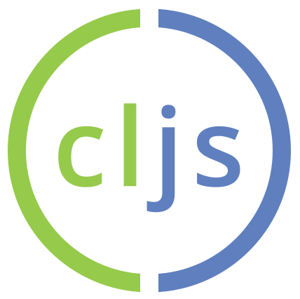

# ClojureScript  API Documentation Project

Hello!  We are building a ClojureScript website.  A section of this website
will be devoted to providing beautiful and informative documentation for the
public functions available in the core library.

__Another clojuredocs?__

Documentation sites like [clojuredocs](http://clojuredocs.org/) and
[grimoire](http://conj.io/) are specific to Clojure.  Though we could help
extend these services with ClojureScript-specific documentation, we are trying
to create a first-class experience for ClojureScript users.

We also have some ambitious design ideas that we want to try out by combining
some of the best ideas from several API documentation websites, clojuredocs and
grimoire included.

__How?__

To document each function/macro, we have a corresponding simple text file with
relevant details (e.g. name, markdown-formatted description, signature, usage
examples).  Using a text file allows us to keep things simple, visible, and
easy to make a Pull Request for changes.

```
<Manual Docfile>

===== Name
cljs.core/assoc-in

===== Signature
[m [k & ks] v]

===== Description

Associates a value in a nested associative structure, where `ks` is a sequence
of keys and `v` is the new value. Returns a new nested structure.

If any levels do not exist, hash-maps will be created.

===== Related
cljs.core/assoc
cljs.core/update-in
cljs.core/dissoc-in
cljs.core/get-in

===== Example

user=> (assoc-in {:foo {:bar "hi"}} [:foo :bar] "bye")
;; => {:foo {:bar "bye"}}
```

We also have a project that __auto-generates__
[documentation files](https://github.com/cljsinfo/api-docs-generator)
for every symbol found in every version of ClojureScript.  We merge the manual
documentation over this auto-generated one to get our final documentation file.

```
<Auto-Generated Docfile>

===== Name
cljs.core/assoc-in

===== Type
function

===== Docstring
Associates a value in a nested associative structure, where ks is a
sequence of keys and v is the new value and returns a new nested structure.
If any levels do not exist, hash-maps will be created.

===== Signature
[m [k & ks] v]

===== Filename
clojurescript/src/cljs/cljs/core.cljs

===== Source
(defn assoc-in
  [m [k & ks] v]
  (if ks
    (assoc m k (assoc-in (get m k) ks v))
    (assoc m k v)))

===== Github
https://github.com/clojure/clojurescript/blob/r2505/src/cljs/cljs/core.cljs#L4018-L4025

===== History
Added in 0.0-927
```

__Special forms__

Of course, not all symbols are functions/macros.  We use the following
pseudo-namespaces to categorize special forms:

- `special/` - symbols that are special forms
- `specialrepl/` - symbols that are special forms for the REPL

__Syntax forms__

Syntax forms are not symbols at all, yet they should still have searchable doc
pages with examples.  To this end, we create a `syntax/` pseudo-namespace with
files named after their description since some are not easily indexed as their
literal forms.

We still want users to be able to search for `()` or `#js` to find docs, so the
`Name` section of each docfile will include its pseudo-namespaced
filename (useful for categorization) followed by any literal forms (emptied if
possible) which are useful as search terms.


```
<Syntax doc headers>

===== Name
syntax/regex
#""

===== Name
syntax/js-literal
#js []
#js {}

===== Name
syntax/keyword
:
::

===== Name
syntax/boolean
true
false
```

__What is left?__

A ton of work has been done, and we have a little bit left:

1. ~~Write initial set of doc files for most symbols~~
1. ~~Parse available symbols and respective metadata from core library~~
1. ~~Scrape usage examples from clojuredocs.~~
1. Add ClojureScript-specific usage examples to the manual docfiles (by copying over those scraped from clojuredocs, and then editing them)
1. Create docfiles for missing symbols.

__How can I help?__

The table below will help us track what is done and what is left to do.
If you want to help out, sift through the table to find a symbol to update,
then submit a PR for that docfile.  Thanks!

